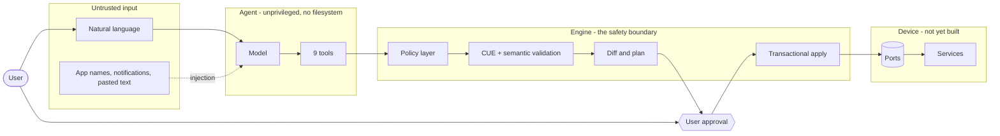

# Threat model: the control plane

**Scope:** the schema, mutation engine, agent boundary, and CLI as they exist today. The device-side
components — real ports, the privileged helper, the on-device model, scroll enforcement — are
designed but unbuilt, and this document marks them as such rather than describing intentions as
controls.

**Method:** enumerate the trust boundaries, then walk attacker classes across them. For each, state
what stops it *today*, what does not, and which ticket closes the gap. A row with no ticket is an
accepted risk and says so.

**Last reviewed:** against `main` at the commit adding this file. Any new input reaching the agent's
context, or any new port implementation, invalidates part of this and requires a revision.

## The system today

The critical structural fact: **the agent's only path to the device runs through policy, validation,
planning, and an approval the agent cannot grant itself.** Everything below is an examination of
whether that holds.

## Trust boundaries

| | boundary | what crosses it | enforced by |
| --- | --- | --- | --- |
| **TB1** | Untrusted content → model context | app names, notification text, pasted prose | nothing yet — see NRM-404 |
| **TB2** | Model → tool surface | tool calls with JSON arguments | `Dispatch`, argument parsing, 9 named tools |
| **TB3** | Tool surface → engine | patch operations against JSON pointers | policy layer, writable roots, schema validation |
| **TB4** | Proposal → applied change | an approved `Plan` | human approval, re-evaluation against current state |
| **TB5** | Engine → device | file writes, service restarts | ports (in-memory today) |
| **TB6** | Contributor → build → device | source, dependencies, workflows | CI, pinned actions, invariant corpus |

## Attacker classes

### A1 — Manipulated agent (prompt injection)

The highest-value attack, because the agent is the intended path to changing the device. An attacker
who controls text the model reads tries to get a harmful change applied.

**Stopped today**

- The agent cannot reach the filesystem. Its paths are config pointers, not file paths; there is no
  tool whose name or arguments accept a filesystem location
- Writes are confined to `/spec`, `/metadata/description`, `/metadata/labels`. `/apiVersion`,
  `/kind`, `/metadata/name`, `/metadata/revision` are engine-managed and refused at the boundary
  *before* the patch is applied
- The attention invariants are types. No accepted patch can produce a config with enforcement off,
  an empty detector list, the shim disabled, or exemptions over cap — the document would not validate
- Everything under `/spec/attention` and every per-app `permissions`, `network`, `state` change
  always requires approval, and no setting makes attention changes auto-applicable
- There is no tool that approves. `Approve` is a session method unreachable from `Dispatch`
- Semantic weakening detection flags dropped enforcement, raised page size or auto-loads, added
  exemptions, and raised budgets — in plain language, not just as a diff
- Per-session proposal and apply quotas bound a looping or flooding agent

**Not stopped today**

- Untrusted content reaching the model's context is not labelled or delimited (TB1) — **NRM-404**
- The approval surface does not yet exist, so nothing enforces that a user sees the engine's diff
  rather than the agent's prose summary. **This is the sharpest gap**: a manipulated model can
  describe a permission grant as tidying a home screen — **NRM-403**
- Attempts are not persisted, so a campaign of rejected proposals leaves no durable trace —
  **NRM-405**, **NRM-121**

**Residual by design:** an injection that produces a *correctly-flagged, approval-requiring*
proposal is working as intended. The boundary's job is to make the worst outcome a visible request,
not a silent change.

### A2 — Malicious or compromised app on the device

**Stopped today**

- Config lives outside app-writable storage in the intended layout, and the engine is the only
  writer

**Not stopped today**

- Nothing verifies that the config on disk was written by the engine. A process that gains write
  access can edit `/etc/normal/*.json` and the change survives — **NRM-122**
- No append-only record of what changed — **NRM-121**
- The privileged helper and its authorization model are unbuilt, so there is no re-validation of a
  plan at the privilege boundary — **NRM-303**
- Rollback to a revision that granted a permission is currently as easy as any other rollback —
  **NRM-123**

### A3 — Hostile network

**Stopped today**

- Nothing on the network path exists yet: no update server, no telemetry, no remote model by default

**Not stopped today**

- Registry distribution (NRM-503) and release delivery (NRM-208) will introduce network trust;
  signing and provenance must land first — **NRM-103**, **NRM-104**, **NRM-122**

**Accepted risk:** none currently, because there is no network surface. This section must be
rewritten the moment one appears.

### A4 — Physical access

**Not stopped today**

- An unlocked device is out of scope, as stated in `SECURITY.md`
- A locked device inherits GrapheneOS verified boot and encryption; Normal adds nothing yet and must
  not weaken it — the layered install (**NRM-304**) is the first point where that could regress

**Accepted risk:** physical access to an unlocked device is not defended. That is the platform's
boundary, not ours.

### A5 — Malicious contributor or dependency

**Stopped today**

- Every action pinned to a commit SHA; a retag cannot substitute code
- The invariant corpus is checked by two independent paths, and a fixture cannot be quietly
  unregistered — the manifest test fails, and a test names the codes that must have a guard. A PR
  loosening an invariant fails CI rather than passing quietly
- `go.mod` tidiness, race detector, coverage floor, and lint all gate merges
- Fuzzing runs nightly with committed crashers as regression seeds

**Not stopped today**

- No SBOM, provenance, or release signing — **NRM-102**, **NRM-103**, **NRM-104**
- Builds are not reproducible, so an independent rebuild cannot corroborate a binary — **NRM-105**
- No dependency review or licence policy gate — **NRM-108**
- No CodeQL or secret scanning — **NRM-107** (blocked on repo visibility or GHAS)
- Signed commits and branch protection not enforced — **NRM-109**

### A6 — Malicious config author

Community config sharing means importing a document from someone you do not trust. This becomes
load-bearing with the surface registry (NRM-503).

**Stopped today**

- Closed CUE definitions reject unknown fields at every depth, so nothing can be smuggled into a
  config that a validator ignores but a service reads
- Document size, nesting depth, and node count are capped before evaluation; a detector's regex is
  length-capped before compilation; evaluation runs under a timeout
- Cross-references are checked: a config cannot reference an app that is not installed
- The attention invariants apply to imported configs exactly as to authored ones

**Not stopped today**

- No provenance on an imported config: nothing says who wrote it — **NRM-122**
- The evaluation timeout returns cleanly but leaks its goroutine; input caps are the real control
  — accepted, documented in `docs/config-schema.md`

## Consolidated gaps

| gap | boundary | if exploited | closes with |
| --- | --- | --- | --- |
| Approval shows agent prose, not engine diff | TB4 | user approves a change they were misled about | **NRM-403** |
| Untrusted content unlabelled in model context | TB1 | injection steers proposals | **NRM-404** |
| Config on disk is unverifiable | TB5 | out-of-band edits persist undetected | **NRM-122** |
| No durable audit log | TB4, TB5 | no forensics; attempts leave no trace | **NRM-121** |
| Rollback can silently regress security fields | TB4 | downgrade attack via a legitimate feature | **NRM-123** |
| Failed rollback leaves a dirty device | TB5 | device stuck inconsistent | **NRM-125** |
| No privileged-helper authorization | TB5 | anything with the helper's ear writes config | **NRM-303** |
| No SBOM, provenance, signing, or reproducibility | TB6 | a substituted binary is undetectable | **NRM-102**–**NRM-105** |
| No dependency or secret scanning | TB6 | a vulnerable or leaking dependency merges | **NRM-107**, **NRM-108** |
| Agent attempts not recorded | TB2 | repeated probing is invisible | **NRM-405** |

## Accepted risks

- **Physical access to an unlocked device.** Platform boundary.
- **The evaluation-timeout goroutine leak.** Input caps bound the work; a genuine timeout returns
  cleanly and leaks one goroutine. Acceptable for a process applying a handful of changes a day.
- **An injection producing a correctly-flagged proposal.** Working as intended; the control is that
  the user sees it, which is NRM-403's job.
- **A user who approves everything without reading.** No technical control fixes this. NRM-403 and
  NRM-506 aim to make the important cases legible rather than frequent.

## Assumptions that would invalidate this

If any of these stops being true, revise before shipping:

1. The agent has no tool that writes files, runs commands, or makes network requests
2. Approval is unreachable from the tool surface
3. The attention invariants remain expressed as types in `schema/normal.cue`, not as runtime checks
4. Every path to the device runs through `PlanApply` and `ApplyPlan`
5. Ports are the only I/O in the engine

Items 1–3 are enforced by tests. Items 4 and 5 are conventions, and are worth a lint rule when the
device side lands.
